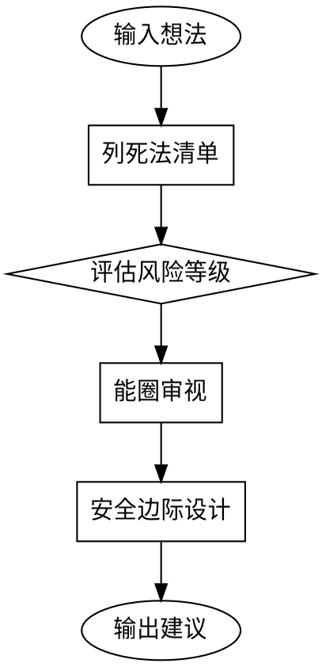

# 反向决策检查

> **核心理念**：芒格说"我只想知道我会死在哪里，这样我就永远不去那里。"先列"死法"，再找活路。

## 使用场景

- 你想开发一个新功能/新产品
- 你在考虑接一个新的需求/合作
- 你有一个新想法，不确定是否值得投入
- 你在多个方向之间犹豫不决

---

## 执行流程



---

## Step 1: 列出"死法清单"

针对用户的想法，列出**至少5个**最可能导致失败的原因：

| # | 可能的死法 | 为什么会死 | 真实案例/类比 |
|---|-----------|-----------|--------------|
| 1 | ... | ... | ... |
| 2 | ... | ... | ... |
| 3 | ... | ... | ... |
| 4 | ... | ... | ... |
| 5 | ... | ... | ... |

### 常见的"死法"类型：

- **需求假死**：以为用户需要，实际上不需要
- **能圈溢出**：超出了你的核心能力范围
- **护城河缺失**：做出来就被复制，没有壁垒
- **时机错误**：太早或太晚进入市场
- **资源枯竭**：投入超过预期，无法持续
- **热点陷阱**：被热点带着走，没有长期价值
- **技术自嗨**：沉迷于"能做什么"而非"用户需要什么"
- **定价困境**：用户付费意愿低于成本

---

## Step 2: 风险评估矩阵

对每个"死法"进行评估：

| 死法 | 发生概率 | 影响程度 | 风险等级 | 规避策略 |
|-----|---------|---------|---------|---------|
| ... | 🔴高/🟡中/🟢低 | 💀致命/⚠️严重/📌轻微 | 🔴/🟡/🟢 | ... |

**风险等级判定**：
- 🔴 **高风险**：概率高 + 影响致命 = 必须解决
- 🟡 **中风险**：概率中等 或 影响严重 = 需要预案
- 🟢 **低风险**：概率低 且 影响轻微 = 可接受

---

## Step 3: 能圈审视

判断这个决策是否在你的能力范围内：

### 你的核心能圈（示例，请根据实际情况调整）

| 能圈类型 | 具体能力 | 验证状态 |
|---------|---------|---------|
| ✓ 核心能圈 | 你最擅长的、已有付费用户验证的能力 | ✅ 已验证 |
| ❓ 边界区域 | 有一定基础但未深入的能力 | ⚠️ 待验证 |
| ✗ 能圈之外 | 完全不熟悉、需要从头学习的领域 | 🚫 需谨慎 |

### 判断结果

```
能圈匹配度：XX%

[✓] 在能圈内的部分：...
[❓] 在边界模糊的部分：...
[✗] 在能圈外的部分：...
```

---

## Step 4: 安全边际设计

如果失败，你的止损方案是什么？

| 维度 | 当前状态 | 安全边际 | 止损方案 |
|-----|---------|---------|---------|
| 时间 | 预计投入X时间 | 预留20%缓冲 | 超过Y时间就停止 |
| 资金 | 预计投入X元 | 预留30%缓冲 | 超过Y元就停止 |
| 精力 | 占用X%精力 | 保留核心业务 | 影响核心业务就停止 |
| 机会成本 | 如果不做这个，能做什么？ | ... | ... |

---

## Step 5: 输出建议

### 决策建议

| 评估维度 | 结论 |
|---------|------|
| 死法风险 | 🔴高 / 🟡中 / 🟢低 |
| 能圈匹配 | ✅ 在圈内 / ❓ 在边界 / ❌ 在圈外 |
| 安全边际 | ✅ 充足 / ⚠️ 紧张 / ❌ 不足 |

### 最终建议

**✅ 可以做**：风险可控，在能圈内，有安全边际

**⚠️ 需要调整**：
- 建议先解决的风险：...
- 建议收缩的范围：...
- 建议增加的安全边际：...

**❌ 建议不做**：
- 核心原因：...
- 如果一定要做，最低限度要先解决：...

---

## 改进建议

如果用户决定推进，给出具体的改进建议：

### 开发前必做

1. **需求验证**：如何验证用户真的需要？具体动作：...
2. **MVP范围**：最小可行版本应该包含什么？不包含什么？
3. **时间限制**：给这个想法多长时间验证？超过就停止

### 关键里程碑

| 时间节点 | 验证目标 | 成功标准 | 失败处理 |
|---------|---------|---------|---------|
| 第1周 | ... | ... | ... |
| 第2周 | ... | ... | ... |
| 第4周 | ... | ... | ... |

---

## 执行后的询问

完成分析后，询问用户：

> **分析完成。是否需要将这份决策检查报告保存到飞书？**
> 
> 如果需要，请告诉我保存到哪个知识库/文档目录，我会帮你创建文档。

---

## 注意事项

1. **不要直接给答案**：引导用户自己思考风险，而不是替用户做决定
2. **用数据和案例说话**：尽量引用真实案例或数据，而非空泛建议
3. **关注机会成本**：始终提醒用户"如果不做这个，能做什么更有价值的事"
4. **保持中立**：不要因为用户想做就一味支持，也不要因为风险存在就一味否定